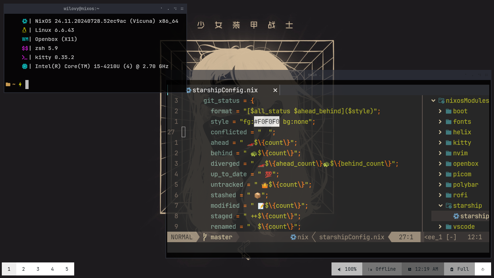

# Mis dotfiles

- [NixOS](https://nixos.org/) es mi OS.
- [Openbox](https://openbox.org/) es mi escritorio.
- [Nvim](https://neovim.io/) con [LazyVim](https://www.lazyvim.org/) es mi editor.
  - [Helix](https://helix-editor.com/) es mi editor secundario.
  - [VSCode](https://code.visualstudio.com/) para cosas que no puedo hacer en los 2 anteriores.
- [xplr](https://xplr.dev/) es mi explorador de archivos.
  - [Thunar](https://docs.xfce.org/xfce/thunar/start) es mi explorador secundario.
- [ZSH](https://www.zsh.org/) es mi shell con [oh-my-zsh](https://ohmyz.sh/).
- [Kitty](https://sw.kovidgoyal.net/kitty/) es mi terminal.
- [Starship](https://starship.rs/) es mi prompt.

## Preview




## Estructura del repo

Estos dotfiles son de un novato con NixOS.

```txt
📁./wilovy.nix
├──📄README.md
├──📄configuration.nix
├──📄flake.lock
├──📄flake.nix
├──📄hardware-configuration.nix
├──📄home.nix
├──📁nixosModules
│  ├──📁boot
│  │  ├──📄bootConfig.nix
│  │  └──📁hyprgrub
│  ├──📁fastfetch
│  │  ├──📄config.jsonc
│  │  ├──📄eye_img.jpg
│  │  ├──📄fastfetchIMG.jpg
│  │  ├──📄fastfetchIMG.png
│  │  └──📄logo.png
│  ├──📁fonts
│  │  └──📄fontsConfig.nix
│  ├──📁helix
│  │  ├──📄base.toml
│  │  ├──📄helixConfig.nix
│  │  ├──📄languages.toml
│  │  └──📄theme.nix
│  ├──📁kitty
│  │  └──📄kittyConfig.nix
│  ├──📄languages.toml
│  ├──📁nvim
│  │  ├──📄init.lua
│  │  ├──📄lazy-lock.json
│  │  ├──📄lazyvim.json
│  │  └──📁lua
│  ├──📁openbox
│  │  ├──📄autostart
│  │  ├──📄menu.xml
│  │  └──📄rc.xml
│  ├──📁picom
│  │  └──📄picom.conf
│  ├──📁polybar
│  │  ├──📄bars.ini
│  │  ├──📄colors.ini
│  │  ├──📄config.ini
│  │  ├──📄modules.ini
│  │  ├──📁scripts
│  │  └──📄user_modules.ini
│  ├──📁rofi
│  │  └──📄config.rasi
│  ├──📁starship
│  │  └──📄starshipConfig.nix
│  ├──📁vscode
│  │  └──📄vscodeConfig.nix
│  └──📁zsh
│     └──📄zshConfig.nix
├──📁public
│  ├──📄img1.png
│  └──📄img2.png
├──📄suzume_door.jpg
└──📄updateDotFile.py
```

## Migrando configuraciones

* [ ] Openbox.
* [ ] Polybar.
* [ ] Rofi.
