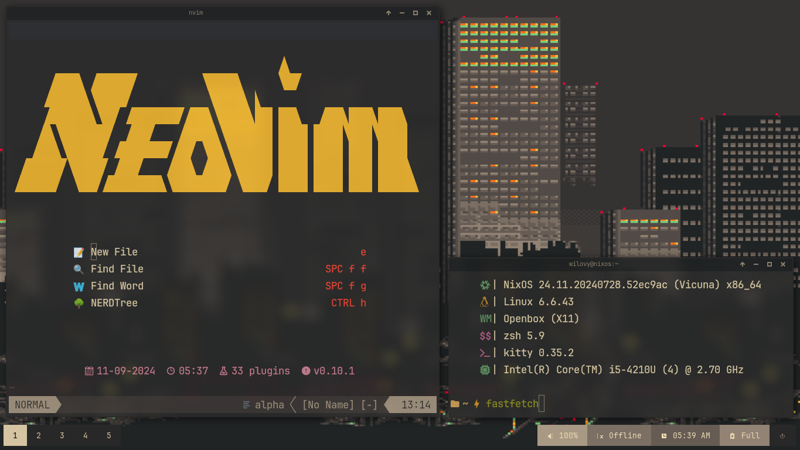

# Mis dotfiles

- [NixOS](https://nixos.org/) es mi OS.
- [LeftWM](https://github.com/leftwm/leftwm) es mi escritorio.
- [Zed](https://zed.dev/) es mi editor.
  - [Nvim](https://neovim.io/) con [LazyVim](https://www.lazyvim.org/).
  - [VSCode](https://code.visualstudio.com/) Solo para ver bases de datos.
- [xplr](https://xplr.dev/) es mi explorador de archivos.
- [ZSH](https://www.zsh.org/) es mi shell con [oh-my-zsh](https://ohmyz.sh/).
- [Kitty](https://sw.kovidgoyal.net/kitty/) es mi terminal.
- [Starship](https://starship.rs/) es mi prompt.

## Preview

